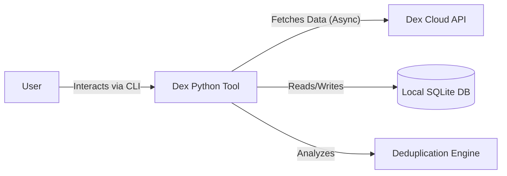
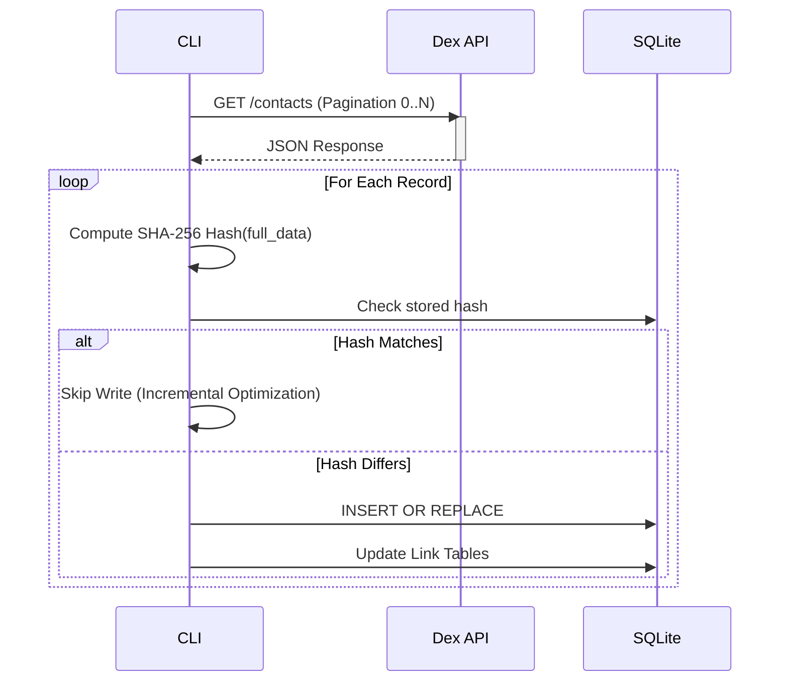

# Architecture Documentation

**Project:** Dex Python & Deduplication Engine  
**Version:** 0.1.0  
**Status:** Active Development

---

## 1. System Overview

The **Dex Python Client** is a robust, local-first CLI application designed to synchronize personal CRM data from [GetDex.com](https://getdex.com), ensure data sovereignty via local storage, and perform advanced contact deduplication.

It functions as a bridge between the cloud-based Dex API and a local SQLite data warehouse, enabling advanced data hygiene operations that are not natively supported by the Dex UI.

### High-Level Context

---

## 2. Architectural Principles

1.  **Idempotency:** Sync operations can be run multiple times without creating duplicate records or side effects.
2.  **Data Integrity:** Changes are detected via cryptographic hashing (SHA-256) rather than relying solely on timestamps.
3.  **Lossless Storage:** Raw API responses are stored as JSON blobs (`full_data`) alongside structured columns to ensure no data is lost during schema evolution.
4.  **Local-First:** All heavy processing (deduplication, analysis) happens locally to preserve privacy and reduce API load.
5.  **Defensive IO:** Network requests use exponential backoff; Database writes use atomic transactions.

---

## 3. Component Breakdown

The application is structured into four distinct layers:

### 3.1. Interface Layer (CLI)
Entry points for user interaction. Built using `rich` for TUI (Text User Interface) elements.
*   `sync_with_integrity.py`: Orchestrator for the synchronization pipeline.
*   `review_duplicates.py`: Interactive tool for human-in-the-loop resolution.
*   `analyze_duplicates.py`: Read-only reporting engine.

### 3.2. Application Logic Layer
*   **Deduplication Engine (`src/dex_python/deduplication.py`):**
    *   Implements a multi-stage matching funnel (Exact $\rightarrow$ Rule-Based $\rightarrow$ Fuzzy).
    *   Uses **NetworkX** to build graph clusters, resolving transitive duplicates (A=B, B=C $\therefore$ A=C).
    *   Uses **Jellyfish** for string distance metrics (Levenshtein, Jaro-Winkler) and phonetic encoding (Metaphone).
*   **Enrichment/Parsing:**
    *   Utilities to parse names and job titles into constituent parts for better matching.

### 3.3. Data Access Layer
*   **Async Client (`src/dex_python/async_client.py`):**
    *   Wrapper around `httpx`.
    *   Handles authentication, rate-limiting (429), and server error (50x) retries.
    *   Manages concurrency using `asyncio.Semaphore`.
*   **Data Models (`src/dex_python/models.py`):**
    *   Pydantic V2 definitions for strong typing and validation of API responses.

### 3.4. Storage Layer
*   **SQLite Database (`dex_contacts.db`):**
    *   Relational tables for `contacts`, `emails`, `phones`, `reminders`, and `notes`.
    *   JSON columns for extensibility.
    *   Link tables (`reminder_contacts`, `note_contacts`) for many-to-many relationships.

---

## 4. Data Flow

### 4.1. Synchronization Pipeline

The sync process is designed for high throughput and correctness.

### 4.2. Deduplication Strategy

1.  **Level 1 (Deterministic):** SQL queries group records by exact Email or normalized Phone.
2.  **Level 2 (Composite):** Matches on `Name + Job Title`.
3.  **Level 3 (Fuzzy):**
    *   **Blocking:** Group records by `Metaphone(Last Name)` to reduce comparison space $O(N^2) \rightarrow O(N)$.
    *   **Scoring:** Calculate Jaro-Winkler similarity on full names.
4.  **Clustering:** All matches are fed into a Graph. Connected components are identified as unique entities.
5.  **Resolution:** The cluster is presented to the user to select a "Primary" ID or flag as a False Positive.

---

## 5. Technology Stack

| Component | Technology | Reasoning | 
| :--- | :--- | :--- |
| **Language** | Python 3.12+ | Robust ecosystem for data and async IO. |
| **Package Manager** | `uv` | Extremely fast dependency resolution and environment management. |
| **HTTP Client** | `httpx` | Modern async support, stronger typing than requests. |
| **Database** | SQLite 3 | Zero-configuration, ACID compliant, distinct file for backups. |
| **Data Validation** | Pydantic V2 | Performance and strict schema enforcement. |
| **Graph Logic** | NetworkX | Efficient handling of transitive duplicate clusters. |
| **Fuzzy Matching** | Jellyfish | Fast C implementations of string distance algorithms. |
| **UI/CLI** | Rich | Modern terminal formatting, progress bars, and tables. |
| **Testing** | Pytest | Industry standard, fixture support. |

---

## 6. Deployment Strategy

Currently, this application functions as a **Local Automation Tool**.

*   **Environment:** Runs directly on the user's machine (macOS/Linux/Windows).
*   **Configuration:** 12-factor app principles via `.env` file (API Keys).
*   **Security:**
    *   Credentials are never stored in the DB.
    *   DB files are `.gitignored` to prevent PII leakage.
*   **Updates:** via `git pull` and `uv sync`.

---

## 7. Scalability & Performance Plan

### Current Capabilities
*   **Throughput:** Syncs ~15k contacts in <60 seconds (incremental).
*   **Concurrency:** 5 concurrent HTTP requests (configurable).
*   **Deduplication:** Efficiently handles 15k+ records using blocking strategies.

### Scalability Bottlenecks & Solutions

1.  **Memory (Fuzzy Matching):**
    *   *Issue:* Loading all names into memory for Level 3 analysis.
    *   *Solution:* Implement iterator-based blocking or offload fuzzy matching to SQLite extensions (e.g., `spellfix1`) if dataset grows >100k.

2.  **API Rate Limits:**
    *   *Issue:* Dex API may throttle aggressive syncing.
    *   *Solution:* The `AsyncDexClient` already implements exponential backoff. Future implementation could respect `Retry-After` headers strictly.

3.  **Database Size:**
    *   *Issue:* `full_data` JSON storage grows linearly.
    *   *Solution:* SQLite handles GBs of data easily. If performance degrades, add indices on frequently queried JSON fields using SQLite Generated Columns.

4.  **Network Bandwidth:**
    *   *Issue:* Must fetch full dataset to detect deletions/changes (API limitation).
    *   *Solution:* Advocate for a `GET /contacts?updated_since=...` endpoint from the API provider.

