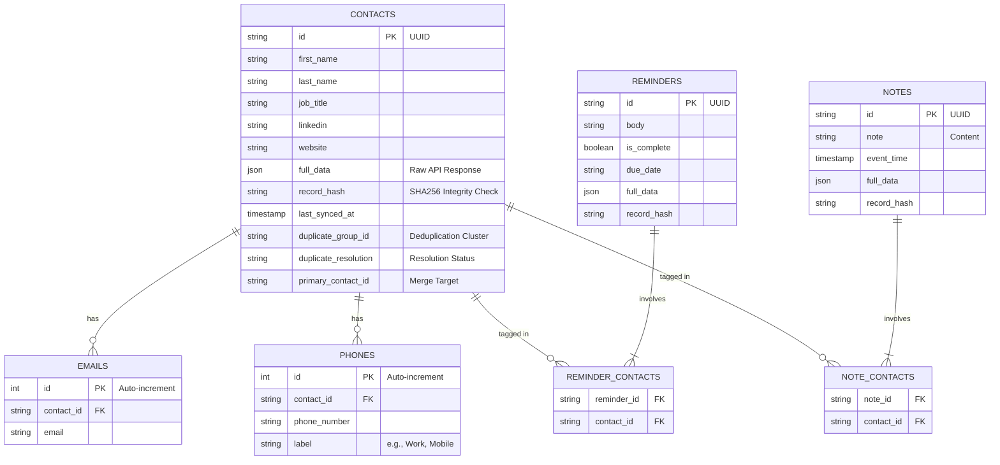

# Database Schema ERD

This Entity-Relationship Diagram (ERD) represents the local SQLite database structure (`dex_contacts.db`) synced from the Dex API.

```mermaid
erDiagram
    CONTACTS ||--o{ EMAILS : has
    CONTACTS ||--o{ PHONES : has
    CONTACTS ||--o{ REMINDER_CONTACTS : "tagged in"
    CONTACTS ||--o{ NOTE_CONTACTS : "tagged in"
    
    REMINDERS ||--|{ REMINDER_CONTACTS : involves
    NOTES ||--|{ NOTE_CONTACTS : involves

    CONTACTS {
        string id PK "UUID"
        string first_name
        string last_name
        string job_title
        string linkedin
        string website
        json full_data "Raw API Response"
        string record_hash "SHA256 Integrity Check"
        timestamp last_synced_at
        string duplicate_group_id "Deduplication Cluster"
        string duplicate_resolution "Resolution Status"
        string primary_contact_id "Merge Target"
    }

    EMAILS {
        int id PK "Auto-increment"
        string contact_id FK
        string email
    }

    PHONES {
        int id PK "Auto-increment"
        string contact_id FK
        string phone_number
        string label "e.g., Work, Mobile"
    }

    REMINDERS {
        string id PK "UUID"
        string body
        boolean is_complete
        string due_date
        json full_data
        string record_hash
    }

    NOTES {
        string id PK "UUID"
        string note "Content"
        timestamp event_time
        json full_data
        string record_hash
    }

    REMINDER_CONTACTS {
        string reminder_id FK
        string contact_id FK
    }

    NOTE_CONTACTS {
        string note_id FK
        string contact_id FK
    }
```
